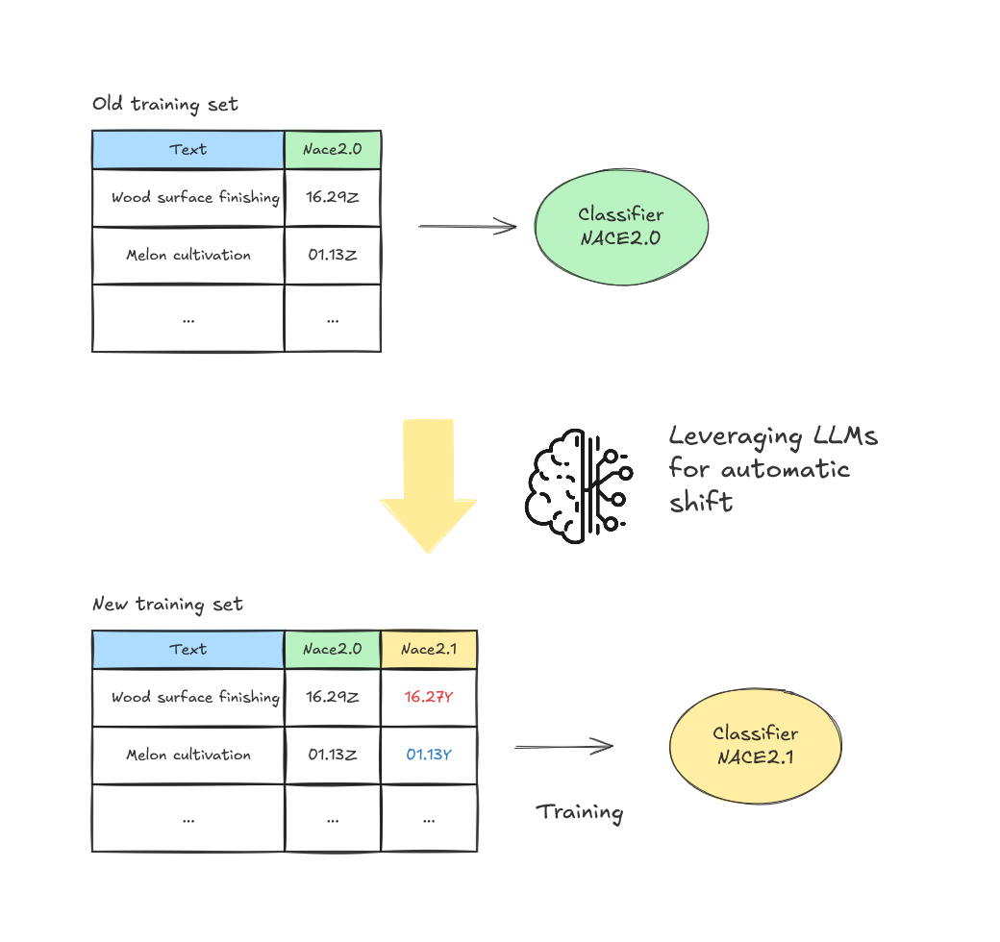
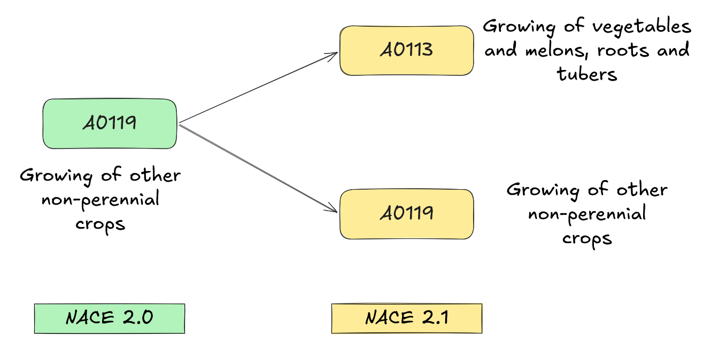
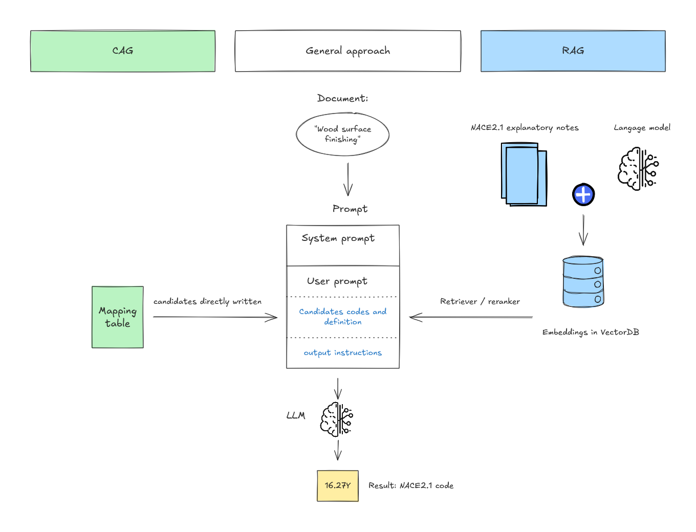
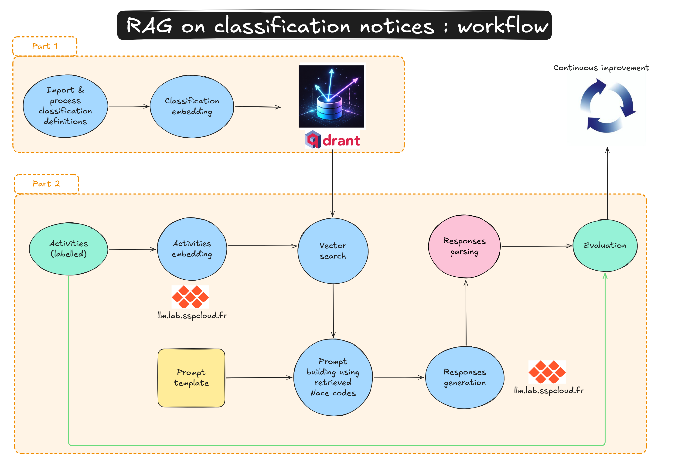

## Sommaire {.smaller}

1. **Contexte et idée générale**
3. **Les données à disposition**
4. **Le pipeline de recodification**
5. **Les briques techniques**
6. **Éléments d'évaluation (et limites)**
7. **Dernières actualités & réentraînement en cours**


# 1. Contexte et idée générale

## Contexte

- Projet en partenariat avec RIAS
- Premier modèle de codification automatique du SSPlab passé en production

::: {.columns}

::: {.column width="50%"}

### Etat initial

- Transition post Sicore
- Modèle de codification automatique de type Fasttext pour coder en NAF 2008
  - Entrainé sur ~2,7 millions de liasses annotées en NAF 2008

:::

::: {.column width="50%"}

### Les évoluations justifiant le projet

- Changement côté SI (Sirène 4)
- Passage progressif NAF 2008 => NAF 2025
  - Besoin d'un modèle qui code en NAF2025
  - Cas particulier du cycle de vie ML :
    - Ce n'est pas le X qui dérive mais le Y (différent d'un réentraînement classique / *datadrift*)
    - Très peu de liasses annotées en NAF 2025 (initialement) => pas d'entraînement d'un nouveau modèle *from scratch* possible

:::

:::

## Idée générale

- On veut :
  - Traduire le trainset NAF 2008 en trainset NAF 2025
  - Et l'utiliser pour entraîner notre nouveau modèle NAF 2025
  - Le processus (à base de LLM) est un **outil de traduction ponctuel**, pas un codeur temps réel

{width=50% fig-align="center"}

## Le cœur du problème : les codes multivoques

::: {.columns}

::: {.column width="50%"}
**Ampleur du changement**

- Nombre de sous-classes : **746 → 732** (modéré…)
- Surtout des **scissions** au niveau 4, quelques fusions / recompositions

**La difficulté vient des cas non bijectifs !**

- **Univoque** : correspondance 1-vers-1
- **Multivoque** : relation 1-vers-plusieurs (~2 à 5 candidats)
:::

::: {.column width="50%"}
{fig-align="center" width=95%}
:::

:::

Pour un code multivoque, la table de correspondance ne suffit pas : il faut **la description de l'activité** et un **jugement**.

## L'échelle du problème

| | Multivoque | Univoque |
|---|---|---|
| Table de correspondance | 25 % | 75 % |
| Jeu d'entraînement réel | **52 %** | 48 % |

- 1,4 million de liasses impossibles à recoder de manière déterministe à l'aide d'une table de passage
- [**On passe à l'échelle en mobilisant un LLM sur ces cas multivoques**.]{.bold}

## Le CAG : classification sous contrainte

**« Quel code parmi les 732 ? »**

- Espace **trop large** pour une génération fiable
- **Hallucinations** très fréquentes (codes inexistants, vieux codes NAF 2008)


**→ Sélection contrainte** *(Context-Augmented Generation, CAG)*

- Pour chaque observation, on connaît déjà le **code NAF rév. 2**
- La table de correspondance donne l'**ensemble des NACE 2025 admissibles** (~2 à 5 candidats)
- La tâche devient : **choisir le bon code dans une courte liste fermée**
- Décision **alignée sur les règles officielles**

## Le RAG comme alternative

{width=82% fig-align="center"}

[**CAG** : candidats issus de la **table de correspondance** (déterministe). **RAG** : candidats issus d'une **recherche sémantique** dans une base vectorielle. Squelette de prompt identique.]{.small}


# 2. Les données à disposition

## Quatre sources pour coder

| Source | Contenu | Rôle | Notes |
|--------|---------|------| ------- |
| **Extraction SIRENE 4** | Libellé d'activité + variables additionnelles | Décrire l'entreprise | Initialement mars à octobre 2024 |
| **Code NAF 2008 (`apet2008`)** | Code en NAF 2008 | Restreindre les candidats | Labellisation par modèle *mais considérée comme très fiable*|
| **Table de correspondance** | NAF 2008 → {NAF 2025 admissibles} | Liste fermée de candidats | |
| **Notes explicatives** | Définitions officielles (comprend / ne comprend pas) | Départager les candidats | |


## Les colonnes de l'extraction SIRENE 4


| Colonne | Signification | Usage LLM |
|---------|---------------|-----------|
| `liasse_numero` | Identifiant unique de la liasse | clé (jointures, dédup) |
| `apet2008` | Code APE / NAF rév. 2 (`0111Z`) | candidats |
| `libelle` | **Description libre de l'activité** | signal principal |
| `activ_sec_agri_et` | Précisions activité agricole | précision |
| `activ_nat_et_libelle` | Autre nature d'activité | précision |
| `cj_libelle` | Catégorie juridique (libellé) | précision |
| `activ_surf_et_libelle` | Surface de vente (m²) | précision |


## Comment on construit la description d'activité

::: {.columns}

::: {.column width="48%"}
**Principe** (`_format_activity_description`)

- On part du `libelle`
- On y **ajoute chaque précision non vide**, préfixée de son étiquette
:::

::: {.column width="52%"}
**Exemple de bloc envoyé au LLM**

```
vente de fromages et produits laitiers
Catégorie juridique de l'établissement :
  société à responsabilité limitée
Surface de vente (en mètre carré) : 45
```
:::

:::

[Le contexte enrichi (catégorie juridique, surface, …) aide à trancher, ex. commerce de détail vs de gros.]{.small}

## Table de correspondance & notes explicatives

::: {.columns}

::: {.column width="50%"}
**Table de correspondance** (officielle)

- `NAF 2008 (sous-classe)` → `NAF 2025 (sous-classes admissibles)`
- Donne, pour chaque `apet2008`, l'**ensemble fermé** de codes 2025 possibles
- Base des candidats **et** de la métrique de couverture
:::

::: {.column width="50%"}
**Notes explicatives** (par code 2025)

- `comprend` — exemples inclus
- `ne comprend pas` — exclusions
- `note générale` — définition

→ le **même matériel de référence** qu'un expert humain.
:::

:::


## La vérité terrain

::: {.columns}

::: {.column width="50%"}
**Campagne d'annotation NACE 2025**

- ~30 000 annotations directement en NACE 2025
- Campagne réalisée en 2024 (?)
- Ciblée sur les cas **multivoques** (les plus durs)
:::

::: {.column width="50%"}
**Ce qu'on en apprend**

- Accord inter-experts **imparfait** : 62 % d'accord strict à 3, 96 % à la majorité
- → interpréter les métriques avec prudence
- Un **protocole de raisonnement** explicite, encodable dans un prompt
:::

:::


# 2. Idée générale


# 4. Le pipeline de recodification

## Vue d'ensemble : 6 étapes

```{mermaid}
%%| fig-width: 11
flowchart LR
  A[0 · Validation<br/>de l'entrée] --> B[1 · Base vectorielle<br/>RAG, optionnel]
  A --> C[2 · Codes univoques<br/>règle, sans LLM]
  A --> D[3 · Codes multivoques<br/>LLM CAG, batché]
  D --> E[4 · Ensemble<br/>vote majoritaire]
  C --> F[5 · Jeu final<br/>NACE 2025]
  E --> F
```

Chaque étape journalise ses `INPUT :` / `OUTPUT :`. Deux modes : **prod** (recoder un fichier) · **eval** (métriques sur lignes annotées).

## Étapes 0 & 2

::: {.columns}

::: {.column width="50%"}
**0 · Validation de l'entrée**

- Barrière : n'écrit rien, **lève une erreur** si problème
- Colonnes requises présentes ?
- `liasse_numero` / `apet2008` non nuls ?
- `apet2008` bien formé (`^[0-9]{4}[A-Z]$`) ?
- Requêtes DuckDB **poussées** sur le Parquet S3
:::

::: {.column width="50%"}
**2 · Codes univoques (sans LLM)**

- Code 2008 → **un seul** code 2025
- Réécriture directe via un `CASE WHEN` **DuckDB**
- Rapide, déterministe, sans coût LLM
- Sortie : `univocal/sirene4_univoques.parquet`
:::

:::

## Étape 3 : encodage des multivoques

Le cœur LLM — **batché et reprenable**.

- On ne garde que les lignes dont `apet2008` est **multivoque**
- Traitement par **lots** (`batch_size`, défaut 1000) : prompts → `call_llm` → parsing → écriture d'un `part-*.parquet`
- **Reprise** : rejouer avec le **même `job_id`** saute les lots déjà écrits → un run planté de plusieurs heures **repart où il s'était arrêté**
- Une **sous-arborescence par modèle** (`ambiguous/{modèle}/results|prompts/`)
- Chaque run publie son **run id MLflow** pour l'étape suivante

## Étapes 4 & 5

::: {.columns}

::: {.column width="50%"}
**4 · Ensemble**

- Récupère les prédictions de chaque modèle (via MLflow)
- **Vote majoritaire** par `liasse_numero` (égalité tranchée par ordre)
- En eval : accuracies + accords ; en prod (`--export`) : écrit `ensemble/sirene4_ambiguous.parquet`
:::

::: {.column width="50%"}
**5 · Jeu final NACE 2025**

- Combine **3 sources** : univoques + LLM + vérité terrain (prioritaire)
- Réattache les variables descriptives (`VAR_TO_KEEP` − code 2008)
- Contrôle d'unicité des `liasse_numero`
- Sortie : `final/sirene4_nace2025.parquet`
:::

:::

## Sorties « job-scoped » & orchestration

::: {.columns}

::: {.column width="52%"}
**Une racine unique par run** (`job_id`)

```
workflow_relabel/{job_id}/
  ├── univocal/   (étape 2)
  ├── ambiguous/{modèle}/  (étape 3)
  ├── ensemble/   (étape 4)
  ├── final/      (étape 5)
  └── run_ids/    (étape 3 → 4)
```
:::

::: {.column width="48%"}
**Argo Workflows**

- Un seul DAG (`relabel.yaml`), étapes 0→5
- **Un seul fichier** à éditer par run (`params.yaml`)
- Runs concurrents = `job_id` distincts, **jamais de collision**
- `job_id` = clé unique de **reprise**
:::

:::


# 5. Les briques techniques

## Construction du prompt CAG

Pour chaque observation, on assemble 4 « emplacements » (`create_prompt`) :

| Emplacement | Contenu | Provenance |
|-------------|---------|------------|
| `activity` | libellé + précisions | SIRENE 4 |
| `nace_old` | `01.11Z : Culture de céréales…` | table (code 2008 + intitulé) |
| `proposed_codes` | candidats 2025 **+ notes explicatives** | table + notes |
| `list_proposed_codes` | `'01.11Z', '01.19Z', …` | liste fermée de choix |

[Le gabarit de prompt lui-même est **versionné dans Langfuse** (label `production`) et compilé ligne à ligne.]{.small}

## Le prompt : système + utilisateur

::: {.columns}

::: {.column width="52%"}
**Prompt système** — identique pour toutes les lignes

> *Tu es un expert de la NACE, chargé du changement de nomenclature. Attribue un code NACE 2025 à partir du descriptif d'activité et d'une liste de candidats issue du code NACE 2008 existant…*

- Choisir **uniquement** dans la liste fournie
- Retourner `null` si l'info est insuffisante
- Vérifier la cohérence de l'ancien code
- Répondre **en JSON strict**, rien d'autre
:::

::: {.column width="48%"}
**Prompt utilisateur** — spécifique à la ligne

```
# Activité principale :
{activity}
# Ancien code NACE 2008 :
{nace_old}
# Codes NACE 2025 candidats + notes :
{proposed_codes}
========
# Choisir parmi : {list_proposed_codes}
# Répondre en JSON
```
:::

:::

[Texte illustratif (prompt géré dans Langfuse).]{.small}

## La sortie : une réponse structurée

::: {.columns}

::: {.column width="48%"}
**Schéma imposé (`CAGResponse`)**

```json
{
  "codable": true,
  "nace2025": "1071B",
  "nace08_valid": true,
  "confidence": 0.92,
  "furnished_rental": false
}
```
:::

::: {.column width="52%"}
- `nace2025` : le code choisi (ou `null`)
- `codable` : la description est-elle suffisante ?
- `nace08_valid` : l'ancien code semble-t-il cohérent ? *(bonus : détecte des erreurs historiques)*
- `confidence` : auto-évaluation 0–1
- `furnished_rental` : cas métier (location de logement meublé)
:::

:::

[JSON strict imposé côté serveur (JSON-Schema) : indispensable pour parser des millions de réponses.]{.small}

## La mécanique d'inférence

::: {.columns}

::: {.column width="50%"}
**Appel LLM** (`base.py`)

- API compatible OpenAI (**llm.lab**), `chat.completions.parse`
- **Sortie structurée** validée par Pydantic
- **Quasi-déterministe** : `temperature = 0,01`, `seed = 2025`
- **Concurrence bornée** (32) + **retries** exponentiels (429/5xx)
:::

::: {.column width="50%"}
**Options**

- Mode **thinking** : budget 100 → 8192 tokens (~10× plus lent)
- **Confiance** : auto-évaluée par défaut *(bascule récente : plus les log-probs)*
- Réponse illisible / `null` → traitée comme **non codable**
:::

:::

## Plusieurs annotateurs virtuels

| Modèle | Taille | Vitesse | Comportement |
|--------|--------|---------|--------------|
| Qwen3-6-35B MoE | 35B | Très rapide (13 it/s) | Modérément restrictif |
| Qwen3-6-35B MoE + thinking | 35B | Lent (~1 it/s) | Moins restrictif |
| Gemma4-26B MoE | 26B | Rapide (8 it/s) | Modérément restrictif |

- Chaque modèle = un **annotateur virtuel indépendant** (open-source, servi en interne)
- **Agrégation par vote majoritaire** : les erreurs complémentaires s'annulent

## La stack MLOps sur le SSPCloud

**SSPCloud** — plateforme data science de l'Insee (projet open-source **Onyxia**, sur **Kubernetes**).

- **MinIO** — stockage S3 (données, artefacts)
- **llm.lab** — fournisseur LLM interne (**OpenWebUI + vLLM**)
- **Qdrant** — base vectorielle (RAG)
- **Langfuse** — versionnage des prompts + traçage
- **MLflow** — suivi des expériences
- **Argo Workflows** — orchestration du pipeline

::: {style="text-align: center; margin-top: 0.5em;"}
{height=40px style="margin: 0 0.5em;"}
{height=40px style="margin: 0 0.5em;"}
{height=40px style="margin: 0 0.5em;"}
{height=40px style="margin: 0 0.5em;"}
{height=40px style="margin: 0 0.5em;"}
{height=40px style="margin: 0 0.5em;"}
{height=40px style="margin: 0 0.5em;"}
:::

[Entièrement open-source, conteneurisé, reproductible.]{.bold}

## Brique alternative : le RAG

::: {.columns}

::: {.column width="46%"}
**Pourquoi ?**

- **Pas de propagation** des erreurs de labels historiques
- Fonctionne **sans labels historiques** ni table de correspondance
- Pipeline **plus général** pour toute codification
:::

::: {.column width="54%"}
{width=100% fig-align="center"}
:::

:::

[**Hors ligne** : base vectorielle (Qdrant) des notes NACE 2025. **En ligne** : on *embed* la description, on récupère les **top-k** codes proches, injectés dans le même squelette de prompt. Coût : un modèle d'embedding + une base à maintenir.]{.small}


# 6. Éléments d'évaluation (et limites)

## Comment on évalue

- Référence : les **~28 000 cas multivoques annotés** à la main (NACE 2025, niveau 5)
- Trois accuracies complémentaires (au niveau sous-classe) :
  1. **Overall** — sur toutes les observations
  2. **Codable** — restreint aux prédictions que le LLM juge lui-même codables
  3. **Mapping-ok** — restreint aux cas où le vrai code **est dans la liste de candidats** (isole la qualité du choix du LLM)

[Le vrai code n'est pas toujours atteignable (erreurs de codage historiques) → une évaluation naïve **sous-estime** le modèle.]{.small}

## Accuracy par modèle & ensemble

[Niveau 5 (sous-classe) — 28 346 observations annotées. % de codes prédits = annotation manuelle.]{.smaller}

| Modèle | Overall | Codable | Mapping-ok |
|--------|--------:|--------:|-----------:|
| Qwen3-6-35B MoE | 75,2 % | 78,3 % | 83,3 % |
| Qwen3-6-35B MoE + thinking | 75,7 % | 80,4 % | 84,1 % |
| Gemma4-26B MoE | 75,2 % | 80,0 % | 83,5 % |
| [**Vote majoritaire**]{.bold} | [**78,3 %**]{.bold} | — | [**86,9 %**]{.bold} |

- Le vote **gagne ~3 points**, mais coûte **3 passes** d'inférence (dont une en thinking)
- Accord entre modèles : **79 %** d'accord total, ~84 % par paire

## CAG vs RAG

[qwen3-6-35b-moe · ~28 500 obs multivoques · seule la source des candidats diffère]{.smaller}

::: {.columns}

::: {.column width="55%"}
| Décomposition (niveau 5) | CAG | RAG |
|---|---:|---:|
| Vrai code dans les candidats | **90,0 %** | 83,5 % |
| LLM choisit juste (si présent) | 83,4 % | 78,1 % |
| **Overall** | **75,3 %** | **65,3 %** |
:::

::: {.column width="45%"}
**Le goulot, c'est le retriever**

- Plancher CAG : taux d'erreur du code 2008 (~10 %)
- Plancher RAG : vrai code hors top-5 (~16,5 %)
- Élargir le top-k = **somme nulle** (recall ↑, choix LLM ↓)
:::

:::

[Réduire l'écart passe par une **meilleure qualité** de retriever (embeddings, reranker), pas un top-k plus large.]{.small}

## Limites

- **Confiance auto-déclarée peu fiable** : modèles sur-confiants, distributions correct/incorrect qui se chevauchent → mauvais filtre en l'état
- **Erreurs historiques héritées** : le CAG dépend des labels NAF rév. 2
- **Coût d'inférence** non négligeable à ~1 M requêtes (surtout le vote + thinking)
- **Plafond d'évaluation** : l'accord inter-experts n'est que de 62 % (strict) — la « vérité terrain » est elle-même bruitée


# 7. Dernières actualités & réentraînement en cours

## Reconstruction du jeu d'entraînement

Une fois le LLM validé sur le benchmark, on applique à l'échelle :

- **~1,0 M** observations multivoques recodées par le pipeline LLM
- Combinées à **~1,3 M** univoques (table)
- **~2,3 M** labels en NACE 2025
- Distribution des codes prédits **très proche** de la distribution observée

::: {.callout-tip}
Un jeu d'entraînement **semi-synthétique** : vraies entreprises, vraies descriptions, mais labels algorithmiques.
:::

## Réentraînement du classifieur

::: {style="text-align: center; margin-top: 0.6em;"}
[**TorchTextClassifiers**]{style="font-size: 1.05em;"} réentraîné sur le corpus semi-synthétique

[~80 %]{style="font-size: 3.4em; font-weight: bold; color:#12406b; display:block; margin:0.2em 0;"}

d'accuracy globale sur un jeu de test NACE 2025 représentatif

**≈** le classifieur NAF rév. 2 historique sur sa propre tâche
:::

[Les labels semi-synthétiques générés par LLM peuvent **se substituer aux annotations manuelles** dans les premières phases d'une transition de nomenclature.]{.bold}

## Ce qui bouge en ce moment

::: {.columns}

::: {.column width="50%"}
**Direction prise**

- Vers un pipeline **CAG-only, mono-modèle** (élaguer le RAG et le vote)
- Confiance auto-évaluée adoptée par défaut (abandon des log-probs)
- Ajout de précisions au prompt (surface de vente, catégorie juridique)
:::

::: {.column width="50%"}
**Chantiers ouverts**

- Améliorer le RAG (embeddings, rerankers) pour le rendre compétitif
- Un signal de confiance **fiable** (cohérence inter-runs, vérifieur)
- Étendre l'approche à d'autres nomenclatures
- Réentraînement du classifieur sur le **dernier millésime** du corpus
:::

:::

## Merci {.center .vcenter}

::: {style="text-align:center; margin-top:1em;"}
**Julien PRAMIL** — Data Scientist, SSPlab

[julien.pramil@insee.fr](mailto:julien.pramil@insee.fr)

[Code : `InseeFrLab/codif-ape-nace-revision`]{.small}
:::
